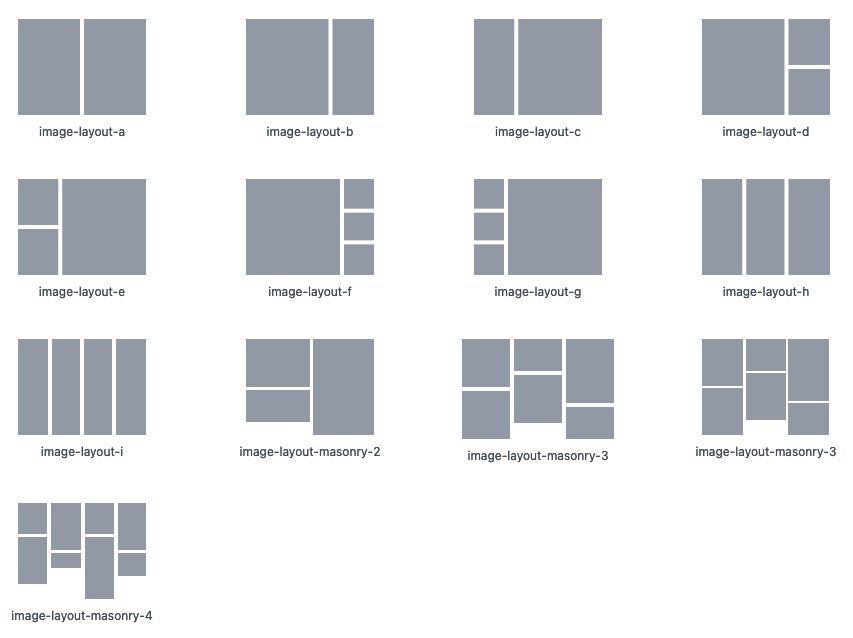

# Obsidian Image Layouts

I wanted a way to lay images out inside obsidian notes in a `beautiful` way. This is my first attempt at that. It's a bit rough around the edges, because it's still quite new, but I hope that it's useful in displaying image heavy notes. I wanted the ability to visually tell stories, and this is a good first step.

Note: Further examples can be found on the documentation. Masonry 5 and 6 are not shown above.

## Usage

In order to get the image layout use \`\`\` followed by the layout you want e.g. \`\`\`image-layout-a

Images can either be in wikilink format `![[imagename]]` in which case it will load from the local vault, or in `` format, which will load either the local or remote image as applicable.

The number of images varies depending on the layout. If you don't have enough it will display a placeholder. If you have too many they'll simply be hidden.

## Roadmap

When I find time I'm hoping to add the following:

- Overlay text on images [DONE]
- Image captions [DONE]
- Permanent overlays [DONE]
- Overlays from markdown links [DONE]
- General gallery to support scrolling through photos
- Drag and drop support
- Visually pick empty layouts

## Documentation

- [Legacy Layouts](https://github.com/vertis/obsidian-image-layouts/blob/main/docs/legacy-layouts.md) - We're moving to a much more capable system, but these are still available. If you used version 0.10.0 or earlier these are the layouts you're probably using. They're still supported and will be for the foreseeable future.
- [Legacy Masonry Layouts](https://github.com/vertis/obsidian-image-layouts/blob/main/docs/legacy-masonry-layouts.md) - As above, these are the original masonry layouts supported.
- [Overlaying Text and Captions](https://github.com/vertis/obsidian-image-layouts/blob/main/docs/text.md)
