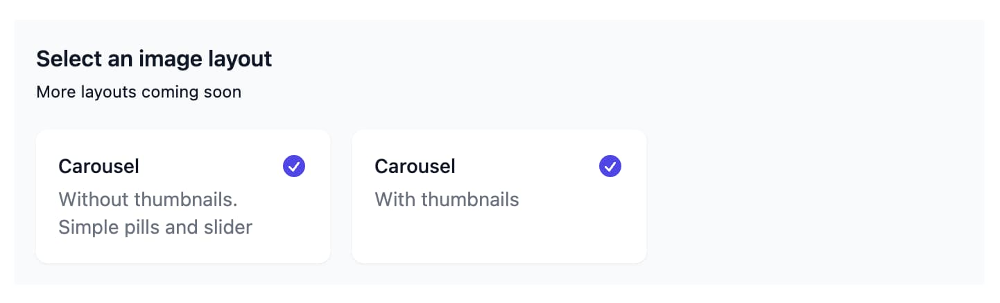

# Carousel

You can access the carousel by adding a new `image-layout` processor to your
project and picking one of the carousel options, or by setting
`layout: carousel` in the front matter directly.

\```image-layout

\```



This will give you a carousel with or without thumbnails.


## Options

````
```image-layout
---
layout: carousel
carouselShowThumbnails: true
carouselBackground: "#101014"   # any CSS color; defaults to the theme background
carouselHeight: 60vh            # number (px) or CSS size; defaults to 24rem
caption: Sailing trip, June
---
![[sunset.jpg|Sunset on the sea]]
![[anchorage.jpg|Our spot for the night]]
```
````

Per-image captions come from the wikilink pipe syntax, markdown alt text, or a
`descriptions` array, and are shown under the current slide. The block-level
`caption` is rendered under the carousel.
