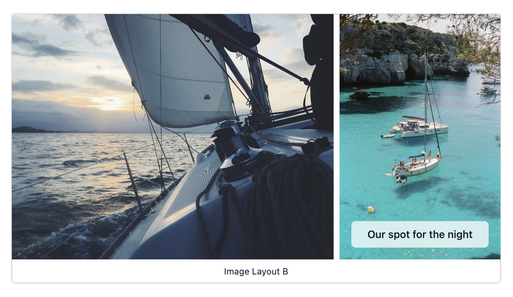

# Overlaying Text and Captions

This is a new feature in 0.11.0.

It's now possible to overlay text on images, and to add captions to images. This is done using YAML front matter. In the future, we'll add support for this in the UI, but for now, it's manual.

```yaml
---
caption: Image Layout B
descriptions:
  - Something
  - Another thing
---
```


