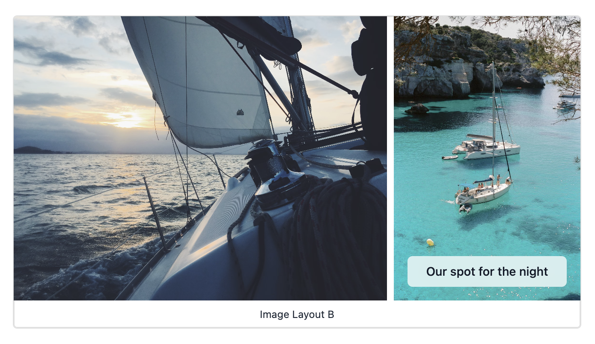

# Overlaying Text and Captions

Captions for the whole layout are created using YAML front matter (inside the
` ``` `). Per-image text overlays can be added in three ways:

- a caption in a wikilink: `![[image.jpg|Some Description]]`
- alt text in a markdown image link: ``
- a `descriptions` array in the front matter (overrides the above)

Text overlays appear when hovering over an image and captions are displayed
beneath the image set. The overlay behaviour can be changed per block with
`overlay: never`, `overlay: hover` or `overlay: always` (the global default
lives in the plugin settings). The older `permanentOverlay: true` is still
supported and means `overlay: always`.

Images without a caption no longer show an automatic "Image 1", "Image 2"
overlay.

````
```image-layout-b
---
caption: Image Layout B
descriptions:
- Sunset on the sea
- Our spot for the night
overlay: always # the default is hover
---


```
````


